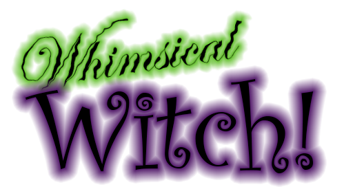

#Documentation

##Summary
This is an enhanced version of the "witch game" which I created for my previous project.  The plan for this project is explained in the [design document](design_doc.docx). 
The list below explains some of the changes that have been made.

###Updated Camera System
The camera now follows a dolly system, allowing for more complex and interesting levels.

###New Player Abilities
The player can now pick up health potions and a power-up for their main spell.  They can also throw bombs.  The player is granted 3 bombs per level.  They may throw the bomb with right-click.  If they right-click again, the bomb will detonate.  Or, they can simply wait for the bomb to hit the ground, or reach a timer.

###Updates to old enemies, plus two new ones!
The ghosts from the previous game have been enhanced to be capable of following paths.  If the ghost is a child of a path-follow node, it will try to follow the path.  Otherwise, it will stay still.  This way, if stationary ghosts are desired, they can also be added easily.
The jiangshi have also been modified to change modes after being hit.  They now change to an ordinary rigid-body and fly backwards, then disappear shortly after.  This is more visually interesting than what was used in the previous game, where these monsters simply disappeared after being hit.
Two new monsters have also been added: the ent, and the flying eye.  The ent simply follows a path and takes up a large amount of space, potentially colliding with the player.  It is harder to banish than most enemies – 5 spells must hit it to banish it.  The flying eye flies along a path, and fires a projectile at the player if they are within line of sight.

###Remastered level
Unfortunately, it wasn’t feasible within my schedule to create three levels as I had intended with this “redux” project.  Instead, I’ve tried to make a very thoroughly developed first level.  It has been dramatically enhanced, with much more scenery and new twists and turns.  A moving terrain piece has also been added, the “maw-soleum.”  This giant stone structure opens and closes its “mouth” at regular intervals.  The player must use their boost carefully to make sure they enter it at the correct time.

###Intro splash screen
A new intro splash screen has been added so that the player isn’t immediately “thrown into” the game.  It takes advantage of 2D shaders to create a visually interesting title screen.

###Sound effects
Sound effects have been added to the game, some of which were original work and some of which were retrieved online.  The following sounds were original:
* Potion throw (throw.wav)
* Health pickup (health_pickup.ogg)
* Power-up pickup (powerup.ogg)
* Enemy shoot sound effect (shoot.ogg)
The following sounds were retrieved online.  Their authors and the source they were retrieved from are also listed.
* Explosion sound effect (explode.wav), created by Michel Baradari.  Retrieved from https://opengameart.org/content/2-high-quality-explosions
* Player magic missile (laser6.ogg), created by Kenney.nl.  Retrieved from https://www.kenney.nl/assets/digital-audio
* Player injured sound (GDYN_Punching_Perc_PRO_SH - 9_edit.wav), created by Joshua Crispin.  Retrieved from http://99sounds.org/fight-sound-effects/

###Updated UI
Some slight modifications were made to the in game UI.  The font has been changed, and the health and boost bars now use textures rather than flat colors.  The “injured” effect also now has an animation.

##How to play

###Goal
Try to reach the end without losing all of your health, and while getting as many points as possible.

##Controls
* __Mouse Movement__ controls your player.
* __Left click__ throws spells that banish monsters.
* __Right click__ throws a potion, or detonates one if there's already a potion in air.
* __W__ boosts your character forward, as long as your boost bar is full.
* __S__ slows your character's forward movement down, as long as your boost bar is full.
* __A__ Tilts your character to the left, making leftwards movement slightly faster, and rightwards movement slightly slower.
* __D__ Tilts your character to the right, making rightwards movement slightly faster, and leftwards movement slightly slower.
* __Double tapping A or D__ starts a barrel roll.  While doing a barrel roll, projectiles bounce off the player.  Your mouse movement also moves your player more.
* __Escape__ unlocks the mouse, allowing you to close the game.
